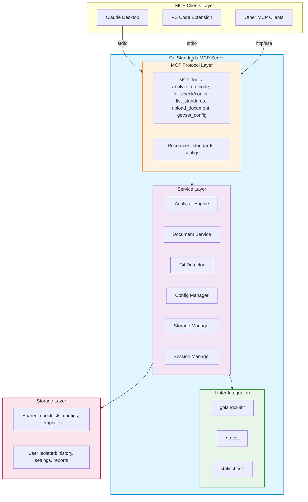

# Go Standards MCP Server

**[中文文档](README_CN.md)** | English

A Model Context Protocol (MCP) service for intelligent Go code quality analysis, integrating industry-standard linters with custom rule engines.

## Features

- **MCP Protocol**: Seamless integration with Claude Desktop and other MCP clients
- **Dual Analysis Modes**: Full repository scan or Git-based incremental detection
- **Custom Rules**: Upload and manage team-specific coding standards
- **Multi-User Ready**: Designed for shared deployment with isolated user contexts
- **CLI + Server**: Flexible deployment options

## Quick Start

### Prerequisites

- Go 1.21+
- golangci-lint (optional, for enhanced analysis)

### Installation

```bash
# Build both server and CLI
make build-all

# Or build separately
make build-server  # MCP server
make build-cli     # Standalone CLI tool
```

### MCP Server Setup

Configure Claude Desktop (`%APPDATA%\Claude\claude_desktop_config.json`):

```json
{
  "mcpServers": {
    "go-standards": {
      "command": "D:\\path\\to\\bin\\mcp-server.exe",
      "args": []
    }
  }
}
```

### CLI Usage

```bash
# Full analysis
go-standards-cli --path ./myproject

# Incremental analysis (Git changes only)
go-standards-cli --path ./myproject --incremental

# Custom config
go-standards-cli --path ./myproject --config rules.yaml
```

## Usage Guide

### 1. Full Code Analysis

Analyze an entire Go project with default settings:

**Using MCP Client (Claude Desktop):**

```
Please analyze the Go code at /path/to/project using analyze_go_code tool
```

**Using CLI:**

```bash
go-standards-cli --path /path/to/project
```

**With specific linters:**

```json
{
  "path": "/path/to/project",
  "mode": "full",
  "linters": ["golangci-lint", "govet"]
}
```

**Expected output:**
- Issue count by severity (error, warning, info)
- Detailed issue list with file location and line number
- Suggested fixes and best practices
- Overall quality score

### 2. Git Incremental Analysis

Only analyze files that have changed in Git, significantly faster for large projects.

#### 2.1 Quick Check if Project is Git Repository

```bash
# Using CLI
go-standards-cli --path /path/to/project --git-check

# Or use git_check tool in MCP
```

**Response:**
```json
{
  "is_git_repo": true,
  "path": "/path/to/project",
  "message": "This is a valid Git repository"
}
```

#### 2.2 Enable Git Integration

**Step 1: Enable Git integration for your project**

```bash
# Using CLI
go-standards-cli --path /path/to/project --git-enable

# Or use git_config tool in MCP with action="enable"
```

This creates a `.go-standards.json` config file in your project root:

```json
{
  "enabled": true,
  "auto_commit": false,
  "auto_push": false,
  "base_branch": "origin/main",
  "fail_on_error": true,
  "hooks_installed": false
}
```

**Step 2: Configure Git integration (optional)**

```bash
# Set base branch for comparison
go-standards-cli --path /path/to/project --git-config \
  --base-branch main

# Configure via git_config tool
```

**Full configuration options:**

```json
{
  "action": "set",
  "path": "/path/to/project",
  "config": {
    "enabled": true,
    "base_branch": "main",
    "auto_commit": true,
    "auto_push": false,
    "config_file": ".golangci.yml",
    "fail_on_error": true
  }
}
```

#### 2.3 Run Incremental Analysis

**Analyze staged files (before commit):**

```bash
go-standards-cli --path /path/to/project --incremental --mode staged
```

**Analyze modified files (working directory):**

```bash
go-standards-cli --path /path/to/project --incremental --mode modified
```

**Analyze files changed from a branch:**

```bash
go-standards-cli --path /path/to/project --incremental \
  --mode branch --base main
```

**Using MCP tool:**

```json
{
  "path": "/path/to/project",
  "mode": "incremental",
  "linters": ["golangci-lint"]
}
```

#### 2.4 Install Git Hooks (Auto-check on commit/push)

```bash
# Install pre-commit hook
go-standards-cli --path /path/to/project --install-hooks commit

# Install pre-push hook
go-standards-cli --path /path/to/project --install-hooks push

# Install both
go-standards-cli --path /path/to/project --install-hooks all
```

After installation, the tool will automatically run when you:
- `git commit` - checks staged files
- `git push` - checks files changed from base branch

**Hook behavior:**
- PASS: If no issues, commit/push proceeds normally
- FAIL: If issues found, commit/push is blocked and issues are displayed
- Configure `fail_on_error: false` to allow commits with warnings

### 3. Custom Coding Standards

Upload your team's coding standards and auto-generate linter configs.

#### 3.1 Upload Standard Document

**Supported formats:** PDF, Markdown, Text

```bash
# Using CLI
go-standards-cli --upload-document /path/to/team-standard.pdf \
  --name "team-v1" \
  --description "Company Go coding standards v1.0"

# Using MCP upload_document tool
```

**What happens:**
1. Document is parsed and analyzed
2. Rules are automatically extracted
3. `.golangci.yml` config is generated
4. Config is saved to `storage/shared/configs/`

#### 3.2 Use Custom Standard for Analysis

```bash
go-standards-cli --path /path/to/project --config team-v1
```

#### 3.3 List Available Standards

```bash
go-standards-cli --list-standards

# Or use list_standards MCP tool
```

**Output:**
```
Available Coding Standards:
1. strict - Highest standards (complexity ≤ 5, coverage ≥ 85%)
2. standard - Balanced standards (complexity ≤ 10, coverage ≥ 70%)
3. relaxed - Basic standards (complexity ≤ 15, coverage ≥ 60%)
4. team-v1 - Company Go coding standards v1.0
```

### 4. Advanced Configuration

#### 4.1 Custom Linter Configuration

Create `.golangci.yml` in your project root:

```yaml
linters:
  enable:
    - gofmt
    - golint
    - govet
    - errcheck
    - staticcheck
    - gosec
  
linters-settings:
  gocyclo:
    min-complexity: 10
  govet:
    check-shadowing: true
  errcheck:
    check-type-assertions: true

issues:
  exclude-rules:
    - path: _test\.go
      linters:
        - gocyclo
```

#### 4.2 Multi-Project Batch Analysis

```bash
# Analyze multiple projects
go-standards-cli --batch \
  --projects "project1,project2,project3" \
  --output batch-report.json
```

#### 4.3 CI/CD Integration

**GitHub Actions example:**

```yaml
name: Code Quality Check

on: [push, pull_request]

jobs:
  quality:
    runs-on: ubuntu-latest
    steps:
      - uses: actions/checkout@v2
      
      - name: Install go-standards
        run: |
          wget https://github.com/MOONL0323/go-standards-mcp-server/releases/latest/download/go-standards-cli
          chmod +x go-standards-cli
      
      - name: Run analysis
        run: |
          ./go-standards-cli --path . --incremental --mode branch --base origin/main
```

**GitLab CI example:**

```yaml
code_quality:
  script:
    - go-standards-cli --path . --incremental
  only:
    - merge_requests
```

## Architecture



**Architecture Components:**

- **MCP Protocol Layer**: 8 tools for code analysis, git integration, and configuration management
- **Service Layer**: Core business logic with parallel execution, caching, and session management
- **Linter Integration**: golangci-lint (40+ checkers), go vet, staticcheck
- **Storage Layer**: Shared resources and user-isolated data with 30-minute session timeout

## MCP Tools

### `analyze_go_code`
Analyze Go code with configurable linters and rules.

**Parameters:**
- `path` (required): Target directory
- `mode` (optional): `"full"` or `"incremental"` (default: `"full"`)
- `linters` (optional): e.g., `["golangci-lint", "govet"]`
- `config` (optional): Custom config file path

**Example:**
```json
{
  "path": "/path/to/project",
  "mode": "incremental",
  "linters": ["golangci-lint"]
}
```

### `git_check`
Quick check if a path is a Git repository.

### `list_standards`
List all available coding standard documents.

### `upload_document`
Upload team coding standards (PDF/Markdown).

**Parameters:**
- `file_path`: Document path
- `doc_type`: `"checklist"` or `"guideline"`
- `language`: `"go"`, `"python"`, etc.

### `get_config` / `set_config`
Get or update Git integration configuration.

## Configuration

### Git Integration (`.go-standards-git.yaml`)

```yaml
git_integration:
  enabled: true
  base_branch: "main"
  ignored_paths:
    - "vendor/"
    - "*.pb.go"
  max_file_size_kb: 500
```

### Analysis Config

```yaml
linters:
  golangci:
    enabled: true
    config_file: ".golangci.yml"
  govet:
    enabled: true

rules:
  max_function_lines: 100
  require_comments: true
```

## Multi-User Deployment

**Storage Structure:**
```
storage/
├─ shared/              # Shared resources
│   ├─ checklists/      # Team standards
│   └─ configs/         # Default configs
└─ users/{userID}/      # User-isolated data (future)
    ├─ history/
    └─ settings/
```

**Docker:**
```bash
docker build -t go-standards-mcp .
docker run -d -p 8080:8080 \
  -v /path/to/storage:/app/storage \
  go-standards-mcp
```

## Development

```bash
make test    # Run tests
make lint    # Lint code
make fmt     # Format code
make help    # View commands
```

## FAQ

**Q: How to use incremental analysis?**  
A: Ensure your project is a Git repository, then use `"mode": "incremental"` or `--incremental` flag.

**Q: Can I use custom coding standards?**  
A: Yes, use `upload_document` to upload team-specific standards.

**Q: Multi-language support?**  
A: Currently focused on Go. Framework supports extension.

**Q: Multi-user deployment?**  
A: Use Docker/Kubernetes with persistent storage. User isolation architecture is ready (see `internal/usercontext/`).

## License

MIT License - See [LICENSE](LICENSE)
