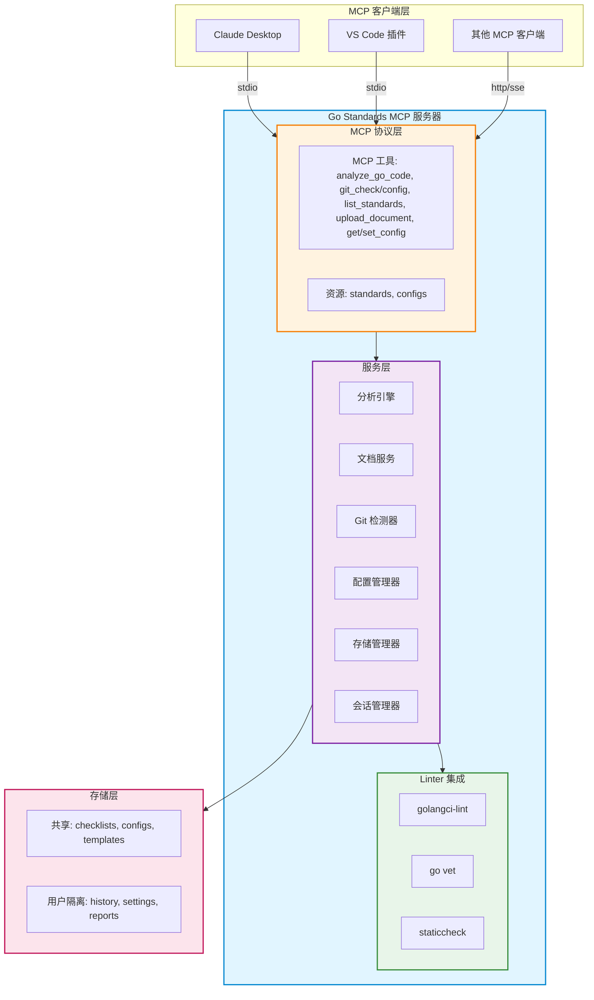

# Go Standards MCP Server | Go 代码规范检查服务

**[English](README.md)** | 中文

基于 Model Context Protocol (MCP) 的 Go 代码质量分析服务，集成业界标准检查工具与自定义规则引擎。

## 功能特性

- **MCP 协议**：无缝对接 Claude Desktop 等 MCP 客户端
- **双模式分析**：全量扫描或 Git 增量检测
- **自定义规则**：上传管理团队专属编码规范
- **多用户就绪**：支持共享部署，用户数据隔离
- **CLI + 服务器**：灵活的部署方式

## 快速开始

### 环境要求

- Go 1.21+
- golangci-lint（可选，增强分析）

### 安装

```bash
# 构建服务器和 CLI
make build-all

# 或分别构建
make build-server  # MCP 服务器
make build-cli     # CLI 工具
```

### MCP 服务器配置

配置 Claude Desktop (`%APPDATA%\Claude\claude_desktop_config.json`)：

```json
{
  "mcpServers": {
    "go-standards": {
      "command": "D:\\path\\to\\bin\\mcp-server.exe",
      "args": []
    }
  }
}
```

### CLI 使用

```bash
# 全量分析
go-standards-cli --path ./myproject

# 增量分析（仅 Git 变更）
go-standards-cli --path ./myproject --incremental

# 自定义配置
go-standards-cli --path ./myproject --config rules.yaml
```

## 使用指南

### 1. 全量代码分析

使用默认设置分析整个 Go 项目：

**使用 MCP 客户端（Claude Desktop）：**

```
请使用 analyze_go_code 工具分析 /path/to/project 的 Go 代码
```

**使用 CLI：**

```bash
go-standards-cli --path /path/to/project
```

**指定特定的 linter：**

```json
{
  "path": "/path/to/project",
  "mode": "full",
  "linters": ["golangci-lint", "govet"]
}
```

**预期输出：**
- 按严重程度统计问题数量（error、warning、info）
- 详细的问题列表，包含文件位置和行号
- 修复建议和最佳实践
- 整体质量评分

### 2. Git 增量分析

仅分析 Git 中发生变更的文件，大型项目速度显著提升。

#### 2.1 检查项目是否为 Git 仓库

```bash
# 使用 CLI
go-standards-cli --path /path/to/project --git-check

# 或在 MCP 中使用 git_check 工具
```

**响应：**
```json
{
  "is_git_repo": true,
  "path": "/path/to/project",
  "message": "This is a valid Git repository"
}
```

#### 2.2 启用 Git 集成

**步骤 1：为项目启用 Git 集成**

```bash
# 使用 CLI
go-standards-cli --path /path/to/project --git-enable

# 或在 MCP 中使用 git_config 工具，action="enable"
```

这会在项目根目录创建 `.go-standards.json` 配置文件：

```json
{
  "enabled": true,
  "auto_commit": false,
  "auto_push": false,
  "base_branch": "origin/main",
  "fail_on_error": true,
  "hooks_installed": false
}
```

**步骤 2：配置 Git 集成（可选）**

```bash
# 设置对比的基准分支
go-standards-cli --path /path/to/project --git-config \
  --base-branch main

# 通过 git_config 工具配置
```

**完整配置选项：**

```json
{
  "action": "set",
  "path": "/path/to/project",
  "config": {
    "enabled": true,
    "base_branch": "main",
    "auto_commit": true,
    "auto_push": false,
    "config_file": ".golangci.yml",
    "fail_on_error": true
  }
}
```

#### 2.3 运行增量分析

**分析暂存区文件（提交前）：**

```bash
go-standards-cli --path /path/to/project --incremental --mode staged
```

**分析已修改文件（工作目录）：**

```bash
go-standards-cli --path /path/to/project --incremental --mode modified
```

**分析从某分支变更的文件：**

```bash
go-standards-cli --path /path/to/project --incremental \
  --mode branch --base main
```

**使用 MCP 工具：**

```json
{
  "path": "/path/to/project",
  "mode": "incremental",
  "linters": ["golangci-lint"]
}
```

#### 2.4 安装 Git 钩子（提交/推送时自动检查）

```bash
# 安装 pre-commit 钩子
go-standards-cli --path /path/to/project --install-hooks commit

# 安装 pre-push 钩子
go-standards-cli --path /path/to/project --install-hooks push

# 同时安装两个
go-standards-cli --path /path/to/project --install-hooks all
```

安装后，工具会在以下时机自动运行：
- `git commit` - 检查暂存区文件
- `git push` - 检查相对于基准分支的变更文件

**钩子行为：**
- 通过：无问题时，commit/push 正常执行
- 失败：发现问题时，commit/push 被阻止，显示问题详情
- 配置 `fail_on_error: false` 可允许有警告时继续提交

### 3. 自定义编码规范

上传团队的编码规范文档，自动生成 linter 配置。

#### 3.1 上传规范文档

**支持格式：** PDF、Markdown、Text

```bash
# 使用 CLI
go-standards-cli --upload-document /path/to/team-standard.pdf \
  --name "team-v1" \
  --description "公司 Go 编码规范 v1.0"

# 使用 MCP upload_document 工具
```

**执行过程：**
1. 文档被解析和分析
2. 自动提取规则
3. 生成 `.golangci.yml` 配置
4. 配置保存到 `storage/shared/configs/`

#### 3.2 使用自定义规范进行分析

```bash
go-standards-cli --path /path/to/project --config team-v1
```

#### 3.3 列出可用规范

```bash
go-standards-cli --list-standards

# 或使用 list_standards MCP 工具
```

**输出：**
```
可用编码规范：
1. strict - 最高标准（复杂度 ≤ 5，覆盖率 ≥ 85%）
2. standard - 平衡标准（复杂度 ≤ 10，覆盖率 ≥ 70%）
3. relaxed - 基础标准（复杂度 ≤ 15，覆盖率 ≥ 60%）
4. team-v1 - 公司 Go 编码规范 v1.0
```

### 4. 高级配置

#### 4.1 自定义 Linter 配置

在项目根目录创建 `.golangci.yml`：

```yaml
linters:
  enable:
    - gofmt
    - golint
    - govet
    - errcheck
    - staticcheck
    - gosec
  
linters-settings:
  gocyclo:
    min-complexity: 10
  govet:
    check-shadowing: true
  errcheck:
    check-type-assertions: true

issues:
  exclude-rules:
    - path: _test\.go
      linters:
        - gocyclo
```

#### 4.2 多项目批量分析

```bash
# 分析多个项目
go-standards-cli --batch \
  --projects "project1,project2,project3" \
  --output batch-report.json
```

#### 4.3 CI/CD 集成

**GitHub Actions 示例：**

```yaml
name: 代码质量检查

on: [push, pull_request]

jobs:
  quality:
    runs-on: ubuntu-latest
    steps:
      - uses: actions/checkout@v2
      
      - name: 安装 go-standards
        run: |
          wget https://github.com/MOONL0323/go-standards-mcp-server/releases/latest/download/go-standards-cli
          chmod +x go-standards-cli
      
      - name: 运行分析
        run: |
          ./go-standards-cli --path . --incremental --mode branch --base origin/main
```

**GitLab CI 示例：**

```yaml
code_quality:
  script:
    - go-standards-cli --path . --incremental
  only:
    - merge_requests
```

## 架构设计



**架构组件说明：**

- **MCP 协议层**: 8 个工具，支持代码分析、Git 集成、配置管理
- **服务层**: 核心业务逻辑，包含并行执行、缓存、会话管理
- **Linter 集成**: golangci-lint (40+ 检查器)、go vet、staticcheck
- **存储层**: 共享资源和用户隔离数据，30 分钟会话超时

## MCP 工具

### `analyze_go_code`
使用可配置的 linter 和规则分析代码。

**参数：**
- `path`（必需）：目标目录
- `mode`（可选）：`"full"` 或 `"incremental"`（默认：`"full"`）
- `linters`（可选）：如 `["golangci-lint", "govet"]`
- `config`（可选）：自定义配置文件路径

**示例：**
```json
{
  "path": "/path/to/project",
  "mode": "incremental",
  "linters": ["golangci-lint"]
}
```

### `git_check`
快速检查路径是否为 Git 仓库。

### `list_standards`
列出所有可用的编码规范文档。

### `upload_document`
上传团队编码规范（PDF/Markdown）。

**参数：**
- `file_path`：文档路径
- `doc_type`：`"checklist"` 或 `"guideline"`
- `language`：`"go"`、`"python"` 等

### `get_config` / `set_config`
获取或更新 Git 集成配置。

## 配置说明

### Git 集成配置 (`.go-standards-git.yaml`)

```yaml
git_integration:
  enabled: true
  base_branch: "main"
  ignored_paths:
    - "vendor/"
    - "*.pb.go"
  max_file_size_kb: 500
```

### 分析配置

```yaml
linters:
  golangci:
    enabled: true
    config_file: ".golangci.yml"
  govet:
    enabled: true

rules:
  max_function_lines: 100
  require_comments: true
```

## 多用户部署

**存储结构：**
```
storage/
├─ shared/              # 共享资源
│   ├─ checklists/      # 团队规范
│   └─ configs/         # 默认配置
└─ users/{userID}/      # 用户隔离数据（待实现）
    ├─ history/
    └─ settings/
```

**Docker 部署：**
```bash
docker build -t go-standards-mcp .
docker run -d -p 8080:8080 \
  -v /path/to/storage:/app/storage \
  go-standards-mcp
```

## 开发

```bash
make test    # 运行测试
make lint    # 代码检查
make fmt     # 代码格式化
make help    # 查看命令
```

## 常见问题

**Q: 如何使用增量分析？**  
A: 确保项目是 Git 仓库，然后使用 `"mode": "incremental"` 或 `--incremental` 参数。

**Q: 可以使用自定义编码规范吗？**  
A: 可以，使用 `upload_document` 工具上传团队规范。

**Q: 支持其他语言吗？**  
A: 当前专注于 Go，架构支持多语言扩展。

**Q: 如何部署给多用户？**  
A: 使用 Docker/Kubernetes 并挂载持久化存储。用户隔离架构已就绪（见 `internal/usercontext/`）。

## 许可证

MIT License - 详见 [LICENSE](LICENSE)
